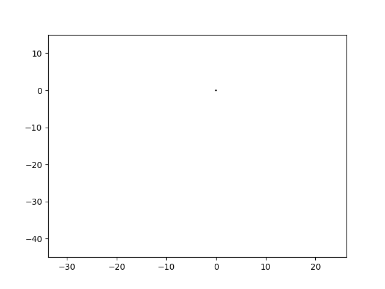

# Some Celestial Mechanics Simulations

The `earth_sun_scip.py` script simulates the Earth's orbit around the Sun,
using the ODE solvers in `scipy.integrate` to approximately solve the
differential equation resulting from Newton's laws. The results
are displayed as an animated graph using `matplotlib.animate`.

One can show (see [Wikipedia](<https://en.wikipedia.org/wiki/Kepler_orbit#Mathematical_solution_of_the_differential_equation_(1)_above>))
that in this model the orbits will be conics -- either circular,
parabolic, or hyperbolic depending on the energy of the initial conditions.
The `scipy` solver allows a fairly accurate approximation in a reasonable
amount of time.
