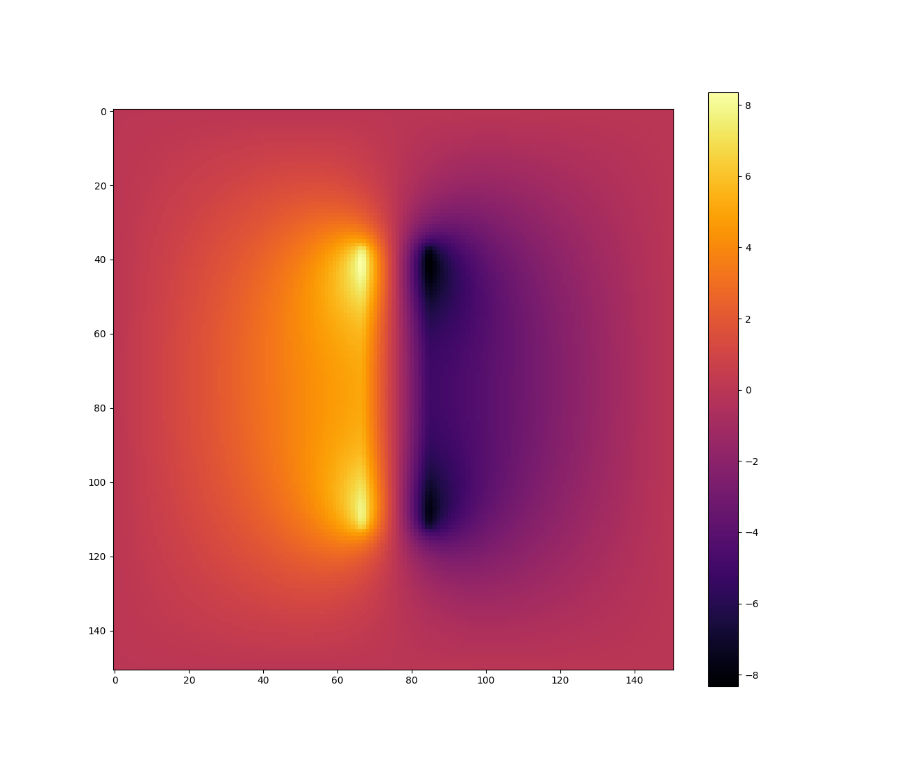

# Poisson Equation Solvers

In this project we'll implement / try out libraries for a few solvers for the Poisson equation,

$$\Delta u = f$$

with various boundary conditions.

## `poisson_direct.py`

This example is based on the idea of finding the electric potential in a
region when the charge density in the region is given. It follows from Gauss's law
(see [Wikipedia](https://en.wikipedia.org/wiki/Electric_potential#Electrostatics))
that the relationship between electric potential and charge density is given by Poisson's equation:

$$-\Delta V_{E} = \frac{\rho}{\epsilon_o}.$$

I wanted to make a realistic model of the potential surrounding the plates of a capacitor.
However, while it is true that the potential is constant inside of a conductor, the realistic
charge distribution in the plates is not uniform. Since the main purpose of this project is to
implement by hand and use existing libraries for various solution methods, I decided to just
come up with my own charge distribution for the sake of the example.
If I had used an iterative method to solve the system, I could have encoded the constant
potential of the plates into each iteration.

In this first example, I use a finite-difference approximation and solve the resulting linear system directly
using NumPy. With a 150 x 150 grid the single-threaded solver already takes about 40 seconds on my moderately-fast
machine. This shows the benefit of using an iterative method vs. a direct method
to solve the sparse system in this problem, which I will do in a future example.

We use the Dirichlet boundary condition

$$u = 0 ~~~\text{on}~~ \partial D$$

which could be the case if the region were enclosed in a metallic box.

Here is a heatmap plot of the solution obtained:

I haven't included any discussion of issues like the accuracy of the approximation here, but I would like to
include such a discussion in future examples.

## `poisson_SOR.py`

This solves the same problem using the iterative method of
[successive over-relaxation](https://en.wikipedia.org/wiki/Successive_over-relaxation)
(SOR).
This serial implementation checks the residual at each step, which is an $O(M^2)$ operation,
where $M$ is the number of mesh points per axis. We could use the analytic expression for
the convergence rate to estimate the number of iterations needed. With $M = 201$ the iteration
converges to within twice machine epsilon in 912 iterations, taking about 110 seconds. The direct
method times out on this problem size.
